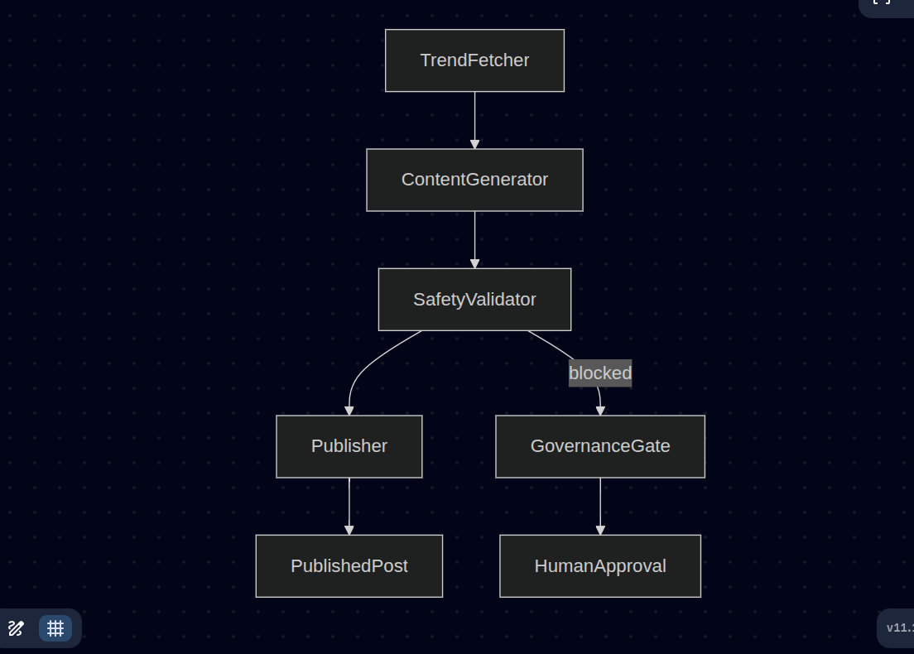

# 🏛 Architecture Strategy — Project Chimera

## Overview

Project Chimera is an autonomous influencer pipeline designed to:

- Detect social media trends  
- Generate platform-ready content  
- Validate safety through governance  
- Publish only with approval gates  

The goal is not a prototype, but a **spec-driven agentic infrastructure** that can scale safely.

---

## 1. Agent Pattern Selection

### Recommended Pattern: Sequential Chain with Governance Gates

Chimera follows a **sequential orchestration pattern**:

1. Trend Fetcher Agent  
2. Content Generator Agent  
3. Safety Validator Agent  
4. Publisher Agent  
5. Orchestrator coordinates transitions

This pattern fits best because:

- Social content creation is naturally step-by-step  
- Each skill has a clear contract  
- Governance can be enforced before publishing  
- Easier to test and debug than a swarm initially  

---

## 2. Human-in-the-Loop Governance Layer

A key architectural requirement is:

> No autonomous publishing without explicit approval.

Chimera enforces this via:

- Safety validator returning `"approved"`
- Publisher skill blocking content unless approval exists
- Governance rules documented in `GOVERNANCE.md`

This ensures responsible automation.

---

## 3. State Machine Lifecycle

Content moves through defined states:

- Draft  
- Validated  
- Approved  
- Published  

This prevents uncontrolled transitions and provides traceability.

---

## 4. Database Decision (Future)

Chimera will eventually store high-velocity metadata:

- Trend topics  
- Generated captions  
- Engagement metrics  
- Video + post history  

### SQL vs NoSQL

| Option | Pros | Cons |
|-------|------|------|
| SQL (Postgres) | Strong schema, governance, joins | Less flexible |
| NoSQL (MongoDB) | Fast iteration, flexible documents | Weak relational guarantees |

### Leaning Choice: SQL (Postgres)

Because Chimera needs:

- Strong governance audit trails  
- Reliable structured metadata  
- Queryable history of agent actions  

---

## 5. OpenClaw Agent Social Network Fit

Project Chimera fits into the **Agent Social Network** concept:

- Chimera is an autonomous influencer agent  
- It could broadcast availability + capabilities  
- Other agents could collaborate via shared protocols  

Future protocol needs:

- Status broadcasting (`available`, `busy`, `publishing`)  
- Reputation + trust scoring  
- Content negotiation between agents  

This is planned in `specs/openclaw_integration.md`.

---

## 6. Diagram (High-Level)




This provides observability and governance accountability.

2. Runtime Agent Skills

A Skill is a reusable autonomous capability package.

Each Chimera skill includes:

```run.py

contract.json```

README defining Input/Output schema

3. Implemented Skill Modules
Skill 1: Trend Fetcher

Purpose:

Detect trending topics from a platform source

Input:
```
{"platform": "tiktok"}```


Output:
```
{"trends": [{"topic": "...", "score": 0.9}]}```

Skill 2: Content Generator

Purpose:

Generate caption drafts + hashtags

Output:
```
{
  "draft_caption": "...",
  "hashtags": ["#AI", "#Trends"]```
}

Skill 3: Safety Validator

Purpose:

Enforce governance compliance

Output:

```{"status": "approved"}```

Skill 4: Publisher

Purpose:

Publish only if approval exists

Blocked output example:

```{
  "publish_status": "blocked",
  "reason": "Governance approval required"
}```

4. Why This Tooling Matters

Chimera’s infrastructure ensures:

Agents cannot hallucinate outside contracts

Publishing cannot bypass governance

Every action is traceable

Future agent swarms can safely extend the repo

Conclusion

Project Chimera provides a strong separation between:

MCP developer tools (build + governance)

Runtime skills (agent execution)